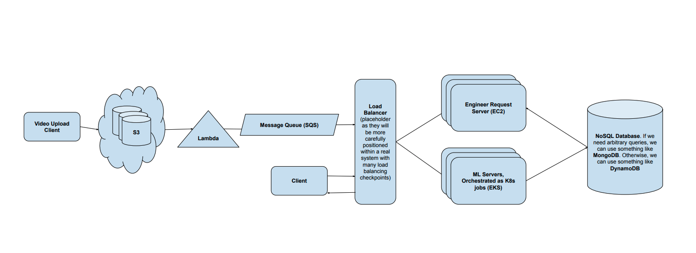

# Video Frame Object Detection System

This project implements a scalable, cloud-based deep learning system for detecting objects in frames extracted from uploaded videos. It leverages AWS services and Kubernetes for a robust, production-ready solution.

## Features

- Video upload and processing
- Automatic frame extraction and storage in S3
- Serverless triggering of object detection pipeline
- Scalable object detection using YOLO on EKS
- Results storage in DocumentDB
- RESTful API for system interaction

## System Architecture

### Technical Architecture Overview

1. **Video Upload**: Users upload videos to a server.
2. **Frame Extraction**: The server extracts frames from the video and uploads them to an S3 bucket.
3. **Lambda Trigger**: On successful upload, an AWS Lambda function is triggered.
4. **Queue Management**: The Lambda function receives paths to the uploaded frames and adds them to an SQS queue.
5. **Object Detection**: An EKS (Elastic Kubernetes Service) cluster consumes messages from the SQS queue.
6. **YOLO Processing**: The EKS cluster runs YOLO (You Only Look Once) object detection on the frame images.
7. **Result Storage**: Detection results are stored in a DocumentDB database.

## Getting Started

(In-Progress)

## API Documentation

(In-Progress)

## Development

(In-Progress)

## Educational Context

This project was initially developed as part of a production ML self-study effort. Its goal was to familiarize with tools and infrastructure frameworks used to deploy and maintain production ML systems at scale.

### Learning Objectives

- Implement a cloud-based, scalable deep learning system for video frame object detection
- Gain experience with AWS services, Kubernetes, and serverless architectures
- Understand the challenges and solutions in deploying ML systems in a production environment
- Optimize for time, memory, and cost
